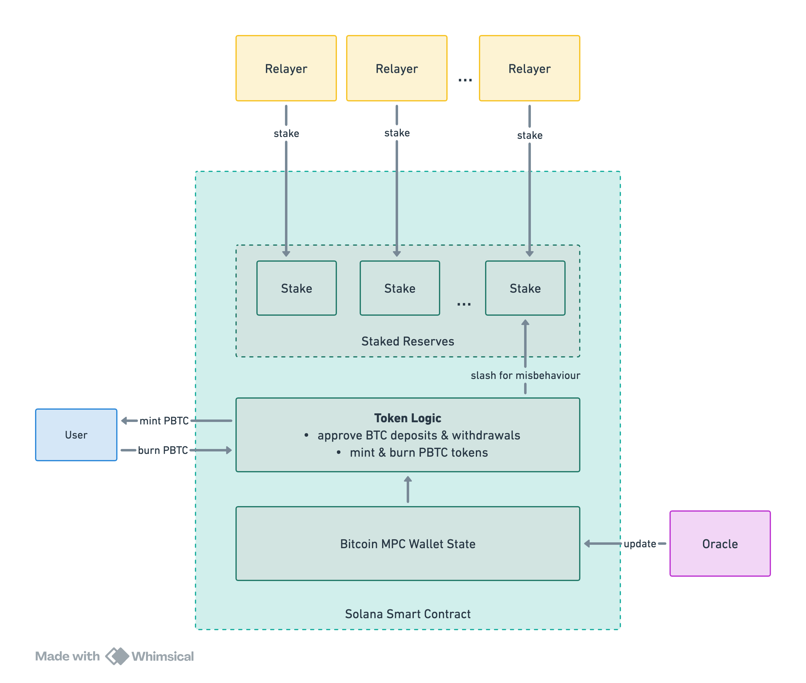

# BTC Port

# Introduction

BTC Port implements a decentralized pegged BTC token on Solana backed by native Bitcoin collateral, as well as pegged BRC-20 tokens on Solana backed by BRC-20 tokens on the Bitcoin blockchain.

The system consists of:

- Solana Smart Contract
- MPC Bitcoin Vault
- Relayers
- Oracle

# Participant Roles

## User

Users that interact with the system on Solana and on Bitcoin can:

- deposit their native Bitcoin or BRC-20 collateral
- mint pegged tokens on Solana
- burn pegged tokens on Solana
- withdraw their native Bitcoin or BRC-20 collateral

## Oracle

The Oracle monitors transactions on the Bitcoin blockchain and provides the Solana Smart Contract with real-time information about:

- User deposits sent to the MPC Bitcoin Vault
- User withdrawals received from the MPC Bitcoin Vault
- Relayers activity processing withdrawals from the MPC Bitcoin Vault

## Relayers

Relayers are the signers of the MPC Bitcoin Vault. They:

- Stake their funds to the Solana Smart Contract as a security deposit
- Monitor the Solana Smart Contract for user withdrawal requests
- Sign user withdrawal transactions from the MPC Bitcoin Vault

Relayers are incentivized to correctly and timely sign user withdrawal transactions, as for misbehavior they risk having their security deposit (stake) slashed by the Solana Smart Contract.

# MPC Bitcoin Vault

The MPC Bitcoin Vault is a decentralized custody address for deposited native BTC and BRC-20 governed by Relayers that sign withdrawal transactions by M-of-N threshold scheme.

MPC stands for Multi-Party-Computation and in this case enables a Threshold Signature Scheme (TSS) to govern a single Bitcoin address by a decentralized collective of parties in a trustless manner.

We implement the TSS algorithm originally described in the paper by Canetti et al. "UC Non-Interactive, Proactive, Threshold ECDSA with Identifiable Aborts”:
[https://eprint.iacr.org/2021/060](https://eprint.iacr.org/2021/060)

The algorithm provides more flexibility and efficiency in comparison to traditional multisig addresses, allowing superior decentralization of our system design, in particular:

- cheap deposit&withdrawal transactions (N times cheaper than a multisig for N parties)
- potentially dozens of MPC parties, improving decentralization (unachievable with multisigs)

### Traditional Multisig

- Every signer’s public key is specified on-chain
- Every transaction through the Multisig is over N times more expensive than a regular Bitcoin transaction
- Impossible to have more than 15 signers
- Cost of transaction at the moment: ~$90

### MPC Wallet

- The wallet has only one public key
- Transactions through the MPC Wallet cost exactly the same as regular Bitcoin transactions
- No limit to the number of signers
- Cost of transaction at the moment: ~$5

Threshold signatures required to run the MPC wallet are computationally heavier and due to that there are practical limitations to the number of signers, but there’s no limit imposed by the blockchain itself like with multisigs. In practice we’ll be able to handle dozens of signers.

Thus MPC offers significantly more decentralization, flexibility and efficiency.

# Solana Smart Contract

The Solana Smart Contract brings together all the participants:

- mints pegged tokens to users that provided sufficient native BTC or BRC-20 collateral
- accepts user requests to withdraw their native BTC or BRC-20, which are then fulfilled by the Relayers
- holds the security deposits staked by Relayers
- keeps track of user deposits and Relayers behavior on the Bitcoin blockchain provided up-to-date information by the Oracle
- slashes the stakes of those Relayers that misbehave, i.e. refuse signing correct withdrawals or attempt to send incorrect withdrawals

# Deposit BTC & Mint PBTC

1. The User declares to the Solana Smart Contract their intent to perform a Bitcoin deposit
2. The Solana Smart Contract verifies that the system is able to accept the deposit and approves the deposit
3. When approved, the User transfers the declared amount of BTC to the MPC Bitcoin Vault
4. The Oracle detects the deposit transaction on Bitcoin blockchain and notifies the Solana Smart Contract about it
5. The Solana Smart Contract accounts for the deposited BTC and allows user to mint BTC
6. User mints PBTC, fully backed by their native BTC

# Withdraw BTC & Burn PBTC

1. The User burns their PBTC and requests to withdraw their BTC collateral
2. The Relayers that monitor the Solana Smart Contract detect the new withdrawal and sign the withdrawal transaction sending BTC to the User
3. The Oracle detects the withdrawal transaction and notifies the Solana Smart Contract of it
4. The Solana Smart Contract checks the correctness of the withdrawal transaction and marks the withdrawal complete

# BRC-20 Tokens

BRC-20 tokens can be transferred with inscriptions on sats to the MPC Bitcoin Vault, and the Vault can send them back by signing an appropriate transaction. The difference is in the details of the Bitcoin transactions, while the rest of the mechanism remains the same. It allows us to issue not only pegged BTC, but also any pegged BRC-20 tokens.

# Staking & Safety Rails

To ensure the reliability of the system Relayers controlling the MPC Bitcoin Vault must be disincentivized against stealing the funds or abusing their position in any way. This is achieved by requiring every Relayer to stake their funds as a security deposit, which they risk losing in case of proven misbehavior.

## Total Assets Pegged

For any attempt of compromising the system to remain unprofitable, thus creating the rules of the game that enable reliable trustless cooperation, the total value of assets pegged must remain below the total value staked by any combination of existing Relayers that would make a quorum.

For example, if we have 36 Relayers controlling the MPC Bitcoin Vault with threshold signature scheme 25-of-36, meaning that any 25 Relayers are sufficient to sign a transaction from the Vault, then the value of Total Assets Pegged must remain lower than the minimum sum of stakes across all possible combinations of 25 out of 36 Relayers, or in general form:

$$
TAP < min \{ \sum_{i \in C} S_i : C \subseteq \{ 1,2,...,N \}, |C|=M \}
$$

where $TAP$ - Total Assets Pegged, $S_i$ - the stake of the i-th Relayer among N

This condition is checked every time a user wants to deposit their BTC or BRC-20 assets for pegging, and the deposit is only approved if the amount they deposit added to Total Assets Pegged will not violate that condition. We can calculate the amount a user can deposit:

$$
D < min \{ \sum_{i \in C} S_i : C \subseteq \{ 1,2,...,N \}, |C|=M \} - TAP
$$

## Minimal Stake Amount

With some assets already in the Vault, it’s important to make sure that the same condition is not suddenly violated when a new Relayer joins. If the new Relayer’s stake is too small, it can make the minimum sum of stakes across all possible quorum groups of Relayers lower than Total Assets Pegged. To prevent such a scenario when onboarding a new Relay we check the following condition for the minimal stake amount:

$$
S > TAP - min \{ \sum_{i \in C} S_i : C \subseteq \{ 1,2,...,N \}, |C|=M'-1 \}
$$

where $M'$ - the new quorum M after adding the new Relayer.

## Relayer Onboarding

1. The New Relayer requests to join the system
2. The minimal required stake is calculated
3. The New Relayer stakes their funds to the Solana Smart Contract
4. The New Relayer joins the MPC and now participates in signing transactions.

## Relayer Offboarding

1. The Leaving Relayer requests to leave the system
2. The system checks that the Total Assets Pegged condition still remains satisfied after the Leaving Relayer is excluded:
    
    $$
    TAP < min \{ \sum_{i \in C} S_i : C \subseteq \{ 1,2,...,N-1 \}, |C|=M' \}
    $$
    
3. The Leaving Relayer signs its exclusion from the MPC
4. The Solana Smart Contract allows the Leaving Relayer to unstake their funds

### Unpegging to leave

If the Leaving Relayer’s stake is critical for some of the possible quorums, the condition for leaving will not be met and the Leaving Relay should withdraw some pegged assets through the system out of Solana back to the Bitcoin blockchain, reducing the saturation of the MPC Bitcoin Vault and thus allowing them to leave.

# Atomic Swaps

BTC Port implements Atomic Swaps to facilitate even more efficient bridging of assets between the networks without having to go through the deposit or withdrawal process described above. Atomic swaps is an approach that enables completely trustless exchange of existing assets on different chains. By using existing capabilities of Bitcoin scripts they make sure the swap is either fully completed or reverted, eliminating any risk for the user and any need in a custodian.

Furthermore they allow a very elegant integration of Lightning Network which reduces the operation finality to only a few seconds.

Atomic Swaps allow the users to:

- swap native on-chain BTC to PBTC on Solana and back
- swap native BRC-20 tokens to their pegged versions on Solana
- swap their BTC on Lightning Network to PBTC on Solana and back **in seconds**

## Automated Liquidity

Further evolution of the protocol allows holders of Bitcoin to provide their BTC and PBTC as liquidity to facilitate Atomic Swaps and earn revenue from swap fees. This not only offers a trustless revenue source as interest on top of held BTC, but also benefits the ecosystem by ensuring the highest possible mobility of BTC across chains.
